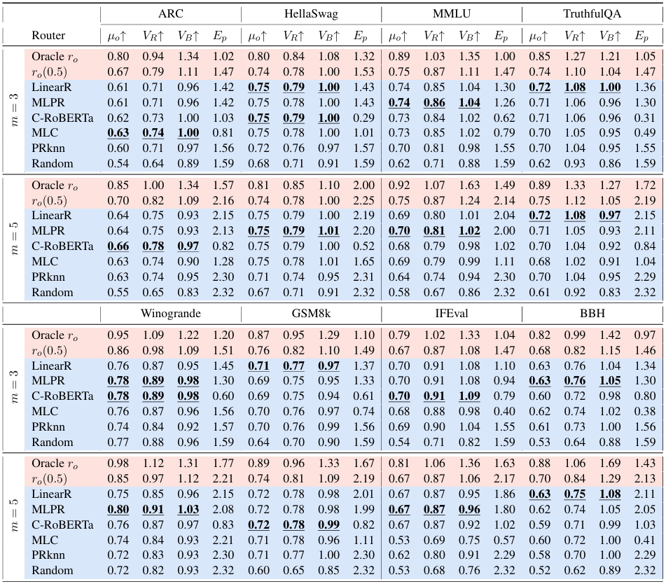
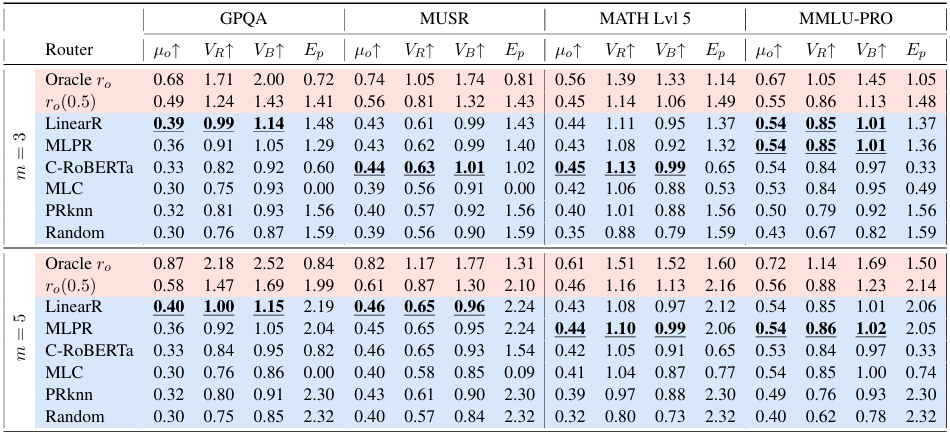

#  RouterEval: A Comprehensive Benchmark for Routing LLMs to Explore Model-level Scaling Up in LLMs

[]()
[]()

RouterEval is a comprehensive benchmark for evaluating router performance in LLM systems, featuring **12 datasets**, **8,500 LLMs**, and **200,000,000 data records**.

## ⚙️ Environment Setup
```bash
pip install -r requirements.txt
```

## 📦 Data Download

Baidu Cloud: [https://pan.baidu.com/s/1h2xeM2iEPJmdp9H-ZQpaMA?pwd=m1ce]

Google Drive: [https://drive.google.com/drive/folders/1LnIk4zKQMjBKX7oFr1-FHUzpsmPISAIQ?usp=sharing]

Hugging Face: [https://huggingface.co/datasets/linggm/RouterEval]

The data format in the cloud drive is as follows.  You can just download the ```router_dataset``` for basic use.
```
data/
├── leaderboard_score/    # 200M score records across 8500 LLMs and 12 datasets
├── leaderboard_prompt/   # Full prompts for all test cases 
├── leaderboard_embed/    # Pre-computed embeddings (4 types)
└── router_dataset/       # ready-to-use router evaluation data (12 datasets)
```

Recommendation➡️ For direct use of our pre-built router datasets:

* Create a ```data``` folder and download ```router_dataset```  to the ```data``` folder
* For basic use, there is **NO NEED** to download ```leaderboard_score```, ```leaderboard_prompt```, and ```leaderboard_embed```.


##  🧪 Testing Baseline Routers
#### Baseline Implementations

```
router/
├── C-RoBERTa-cluster/    # C-RoBERTa router
├── MLPR_LinearR/         # mlp & linear router
├── PRKnn-knn/            # kNN router
├── R_o/                  # Oracle & r_o & random router
└── RoBERTa-MLC/          # MLC router
```

#### Experimental Settings
| Difficulty Level | Candidate Pool Size   | Candidate Groups                |
|------------------|-----------------------|--------------------------------------|
| Easy             | [3, 5]                | all strong / all weak / strong to weak                   |
| Hard             | [10, 100, 1000]       | all strong / all weak / strong to weak       |


#### Run evaluation:
```
python test_router.py
```

## 🛠️ Testing Custom Routers
If you want to design a router and test its performance on the router datasets, you can follow the steps below.

1. Create new folder under ```router/```

2. Implement your method with required format:

```python
# train your router
......
# test your router
......
# compute metircs (Must print these three metrics at last)
......
print(mu, vb, ep)  
```

3.  Add command to run your router in ```test_router.py```.

4.  Run ```test_router.py``` to test your custom router.

## 🔧 Advanced Tutorial 1: Replacing the Embedding Model
Advanced Usage (**optional**) ➡️ For custom embeddings, you can:

* Download ```leaderboard_prompt```  and process with your embedding model.
* Download ```leaderboard_embed``` and use existing pre-computed embeddings  (including four embed models: longformer, RoBERTa, RoBERTa_last, and sentence_bert).

## 🔧 Advanced Tutorial 2: Constructing Router Dataset
Advanced Usage (**optional**) ➡️ To reproduce the construction process of the Router Dataset, you can: 

1. Download ```leaderboard_score```, ```leaderboard_prompt```, and ```leaderboard_embed```

2. Place the three folder in ```data/``` directory

3. Run ```get_router_dataset.py``` to build router datasets:

```base
python get_router_dataset.py
```


## 📊 Baseline Results 




## 📜 Citation